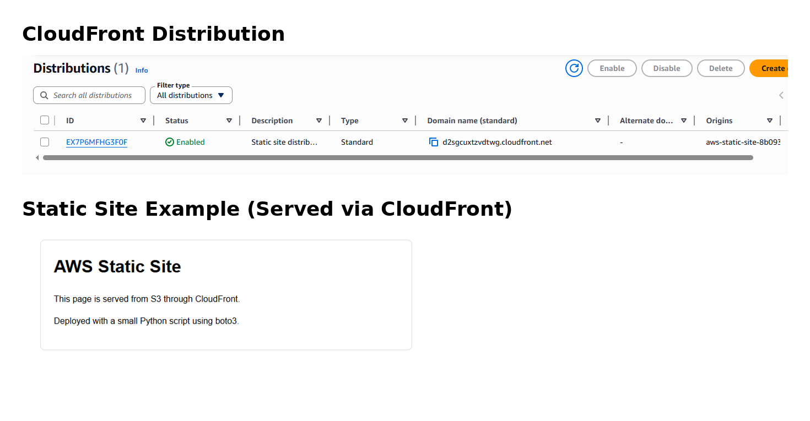

# aws-static-site

Deploys a static website to Amazon S3 and serves it securely through CloudFront using automated Python deployment scripts.

Topics: `aws`, `cloudfront`, `s3`, `boto3`, `infrastructure-automation`, `python`

## Project Summary
Small Python project that uploads a static page to S3 and serves it through CloudFront.

## Architecture Overview
`website/index.html` is uploaded to a private S3 bucket. CloudFront reads from the bucket using Origin Access Control, and the distribution URL is returned.

## AWS Services Used
- Amazon S3
- Amazon CloudFront
- AWS Security Token Service (STS)

## Deployment Instructions
1. Set AWS credentials and default region in your environment or AWS config.
2. Install dependencies:
   `pip install -r requirements.txt`
3. Run:
   `python deploy.py`

The script prints the CloudFront URL and saves a local `deployment.json` file for cleanup.

## Cleanup Instructions
Run:
`python cleanup.py`

## Concepts Used/Learned
- CloudFront distribution deployment
- S3 static hosting configuration
- Automated infrastructure provisioning using boto3
- Resource lifecycle cleanup to prevent unnecessary AWS costs

## Example Output

